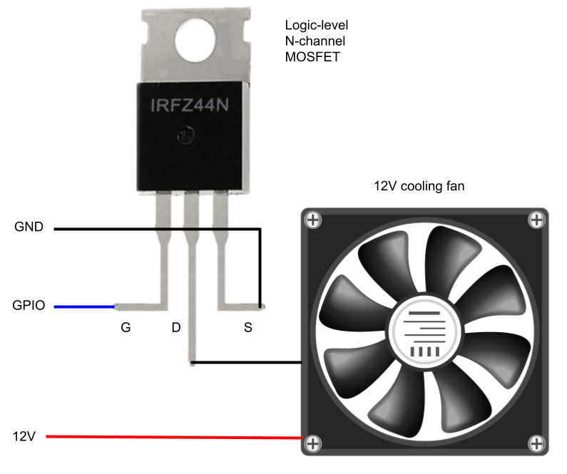
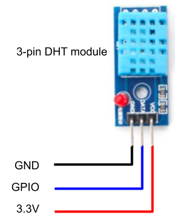
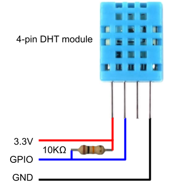

# OctoPrint Simple Chamber

Simple chamber temperature controller: run fan if chamber temperature is higher than a certain value.

Chamber temperature is automatically displayed in the `Temperature` tab.

This plugin is intended to be used with OctoPi.

## Supported hardware

DHT11, DHT21 and DHT22 temperature sensors are supported.

Any 12V cooling fan is supported. 5V cooling fans are not recommended, as they aren't strong enough for
cooling down a 3D print enclosure.

## Installation

Install manually using this [archive URL](https://github.com/adrcunha/OctoPrint-SimpleChamber/archive/master.zip):

	https://github.com/adrcunha/OctoPrint-SimpleChamber/archive/master.zip

The plugin supports two ways of reading the temperature sensor (selected in the plugin settings):

* Through [Adafruit CircuitPython DHT Library](https://github.com/adafruit/Adafruit_CircuitPython_DHT):
  Requires the system library `libgpiod2`, which must be installed from command line by running
  `sudo apt-get install libgpiod2`.

* Through a [Device Tree overlay](https://github.com/raspberrypi/firmware/blob/master/boot/overlays/README):
  Requires the line `dtoverlay=dht11,gpiopin=XX` to be added to `/boot/config.txt`, where `XX` is the GPIO
  pin connected to the sensor's DATA pin.

## Hardware connection

You can use any logic-level N-channel MOSFET compatible with the voltage and current required by the cooling fan.

Connect the gate to the GPIO pin defined in the settings, the drain to the fan's negative wire, the source to GND
and the fan's positive wire to 12V.

If using a 3-pin DHT sensor, just connect the GND pin to GND, VCC pin to any 3.3V GPIO pin, and the DATA pin to
the GPIO pin defined in the settings.

If using a 4-pin DHT sensor, connect the first pin to any 3.3V GPIO pin, the second pin to the GPIO pin defined
in the settings, and the fourth pin to GND. You must also connect a 10 kiloohm resistor between the first and
second pins. The third pin is not used.

## Plugin settings

Chamber temperature is measured by the DHT sensor conhected to a GPIO pin. If using the Adafruit CircuitPython
DHT Library to read the sensor data, the sensor type and GPIO pin must be set in the plugin settings.

Fan is controlled through PI + PWM via the GPIO pin defined in the plugin settings.

The maximum temperature (in Celsius) is also defined in the plugin settings.

If you're not interested in installing a fan, uncheck the `Fan enabled` box.

## Troubleshooting

* Check OctoPrint's log file for clues (e.g. missing `libgpiod` library, wrong wiring exception, etc).
* Double-check the wiring of the the sensor and cooling fan.
* Double-check the GPIO pins used (both in the plugin configuration and in the Raspberry Pi header).

## Acknowledgements

Inspired by (sometimes pretty strongly):

* [OctoPrint-PlotlyTempGraph sample](https://github.com/jneilliii/OctoPrint-PlotlyTempGraph/blob/master/klipper_additional_temp.py)
* [Andreas Spiess' video #138](https://www.sensorsiot.org/variable-speed-cooling-fan-for-raspberry-pi-using-pwm-video138/)
* [OctoPrint-EmailNotifier plugin](https://github.com/adrcunha/OctoPrint-EmailNotifier)
* [OctoLight Plugin](https://github.com/adrcunha/OctoLight)

## License

Licensed under the terms of the [AGPLv3](http://opensource.org/licenses/AGPL-3.0).
